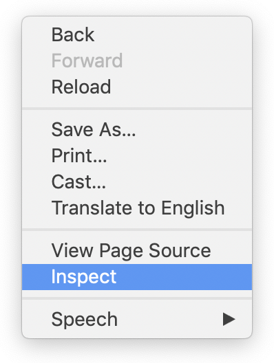
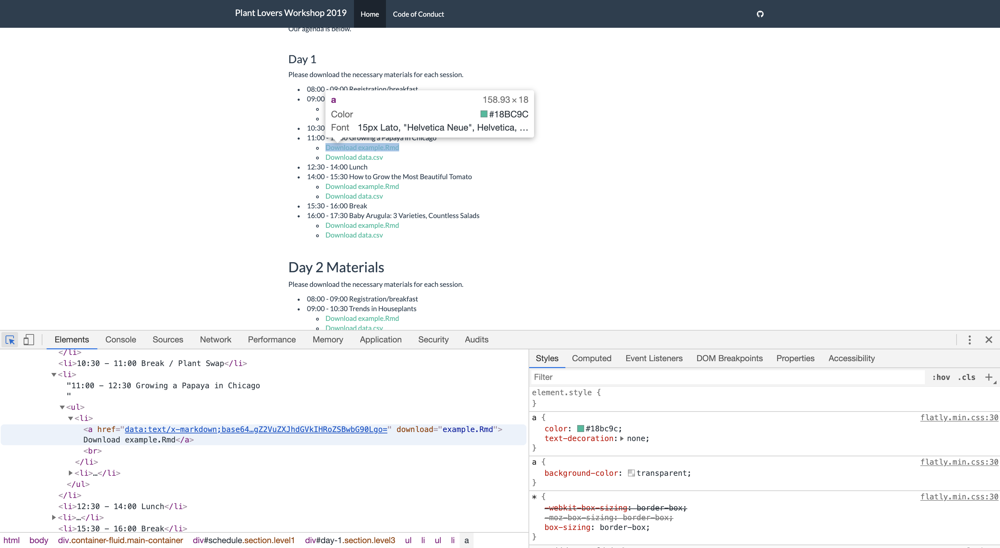
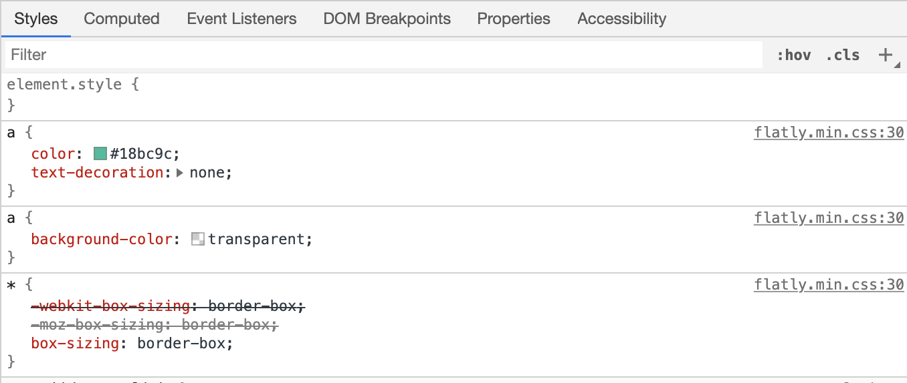
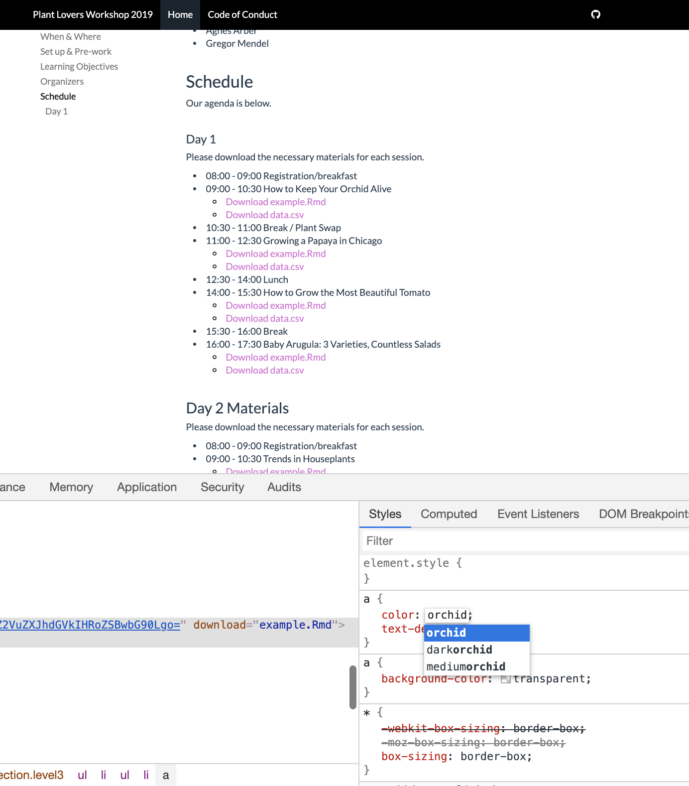
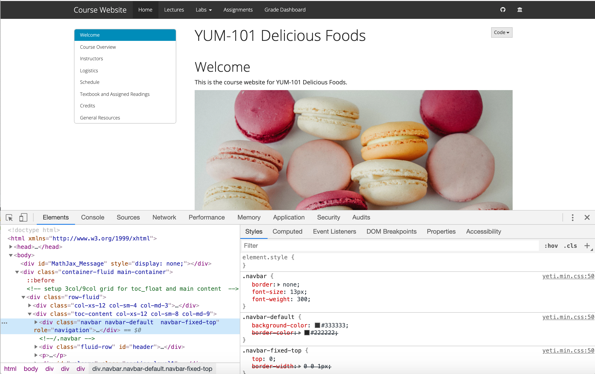
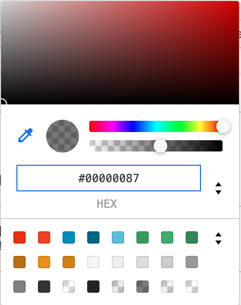

# CSS Crash Course {#css-crash}


Every element of a website that you see, from links to pictures to paragraphs, has a category label. These labels can be tags (for example, all links on websites have `a` tags, all big headers have `h1` tags), or they can be IDs or classes (described later).  If you know the label for something on a website, then you can style its appearance by using a `.css` file. In a CSS file, you write style rules that will apply to all elements of the same category. This is a very useful thing to be able to do because it allows you to break free from the limitations of built-in templates and themes that come with R Markdown.

Below is a quick example of some CSS that would change all link colors to the color "orchid" and all link text from being uppercase:

```{r, eval=FALSE}
a {
  color: orchid;
  text-transform: uppercase;
}
```

You begin with the element's "label" (technically called a *selector*). Within curly braces, `{ }`, you can include as many different style properties as you'd like for that element. Each new property must end with a `;`.  What are your options for properties to style? [There are many](https://www.w3schools.com/cssref/), but don't feel overwhelmed-- just pick one or two things to change as you start out.

## What's in a name?

How could you have known that the selector for links was an `a`? The answer is by opening up your existing website, and right-clicking anywhere on the page and clicking on *Inspect* (in Chrome browsers) or *Inspect Element* (in Firefox).

<center> {width=300px} </center>

Clicking on this will open a small set of windows inside of your browser called the Developer Tools (a.k.a "devtools") or the inspector. These give you an inside peek into all the CSS styles that are being applied to every element in the site. (The examples that follow use the Chrome developer tools.)

In the lower left pane of the subwindow, click on the icon of a rectangle with an arrow. Now as you hover and then click on anything in your website, you will see the contents of the developer tools change. The pane on the right shows the CSS styles that are applied. 

<br>


<br>

Taking a closer look at the CSS pane on the right, we can see that the link we are hovering over does indeed have an `a` as its selector. 

<br>



<br>


One neat thing about the developer tools is that you can click and temporarily edit the CSS properties in this very window and  simlutaneously see the changes take effect on the page. These edits only happen in your browser, so nothing in your R Markdown document will change (in fact, your edits will be lost as soon as you refresh the page in your browser), but editing here is a fast way to test out any CSS ideas.

[ALSO ADD TEXTTRANSFORM IN SCREENSHOT TO MATCH ABOVE EXAMPLE]

<br>


<br>

There's a lot more we could say about CSS here. But it's faster and more rewarding to learn via real examples. Let's start tinkering!

[OTHER TOPICS TO MENTION:]
[1. EXAMPLES OF CLASSES AS CSS SELECTORS. (WHY DO SOME SELECTORS BEGIN WITH . AND OTHERS DON'T?)]
[2. MULTIPLE ATTRIBUTES. COMBINING THEM WITH `.` vs separated by spaces ]

## How do I change the color of....?

I'm going to model how I would go about changing the color of the navbar of an RMD site. We'll use the developer tools to try out different options in real time.

1. Pull up your site and right click to open the developer tools. 
1. When we click on the navigation bar, we see that it highlights a certain line of HTML in the left pane of the developer tools. Look for anything that says `class = `. The values that follow `class` are the CSS selectors that are currently styling our navigation bar. 

In this case, our navbar has three classes `navbar`, `navbar-default`, and `navbar-fixed-top`. 

    


In the righthand pane of the developer tools. we see these classes being used in the CSS (notice that a class needs to have a `.` before it in when it's a selector--but a tag, like the link example above, does not). 

[SAY SOMETHING ABOUT THE ORDER EACH ARE LISTED?]


1. Let's choose the first CSS selector `.navbar` and play around with it in this pane to decide what color we'd like.
1. Type `background-color:` followed by any [HEX code or rgb code](https://www.google.com/search?q=color+picker) and press `Enter`. You can also click on the small color square to use sliders to set the color and transparency of your navigation bar. I'm selecting _________ color.  

    <center>{width=200px}</center>

<br>

1. When you change the color in the developer tools, you should see the element on your site also changing in real-time. Cool, huh? If you don't see the color changing on your site, then it means you either have the wrong selector OR it means that something else is overriding your color choice (do you see a strikethrough line through what you just wrote?). You can force it to go with your choice by adding `!important` to the end of line you added, right before the `;`.


1. Now we need to immortalize your color choice by putting your selector and your color choice in a CSS file. 

1. Make a CSS file (file > new file > text file > save as style.css) and paste something like this into it.

```style.css

.navbar {
  background-color: #fcfcfc;
}

```

1. Link your CSS file to your R Markdown site/blog/tool...see the specific cookbook for how to do this for your particular tool.

1. Build your site--do you see your CSS style taking effect?


