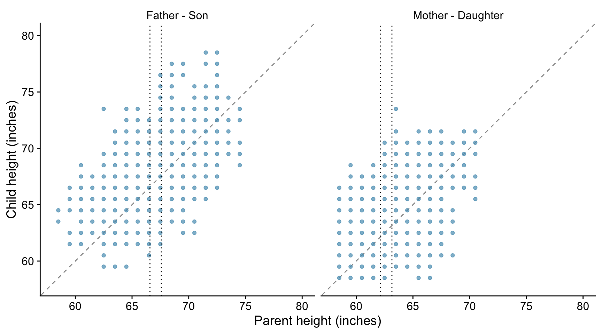
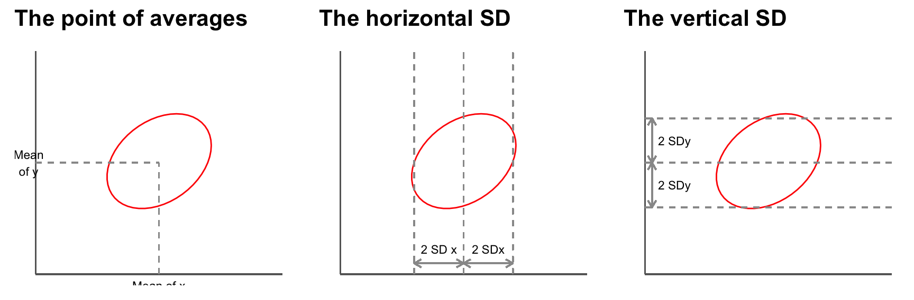
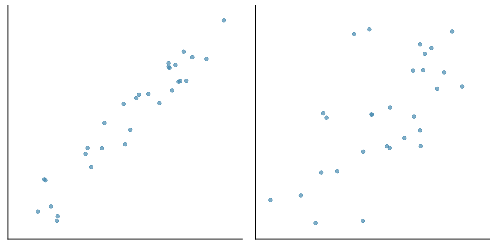
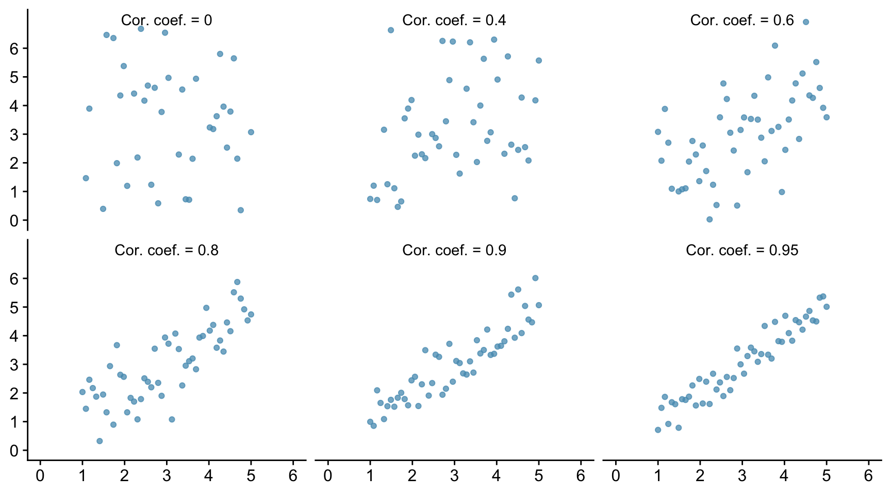
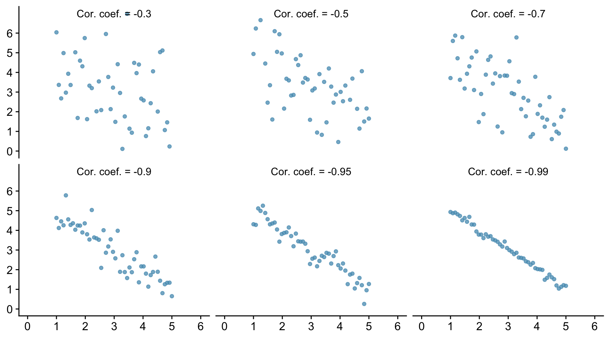
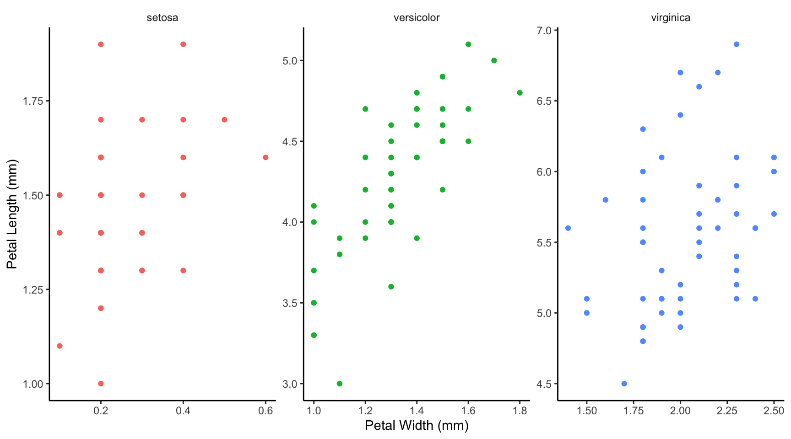
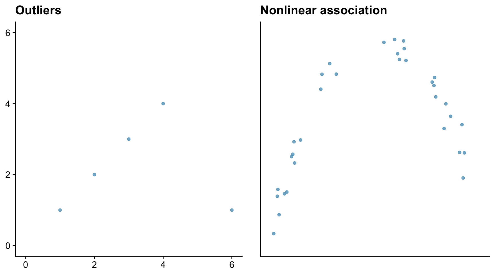
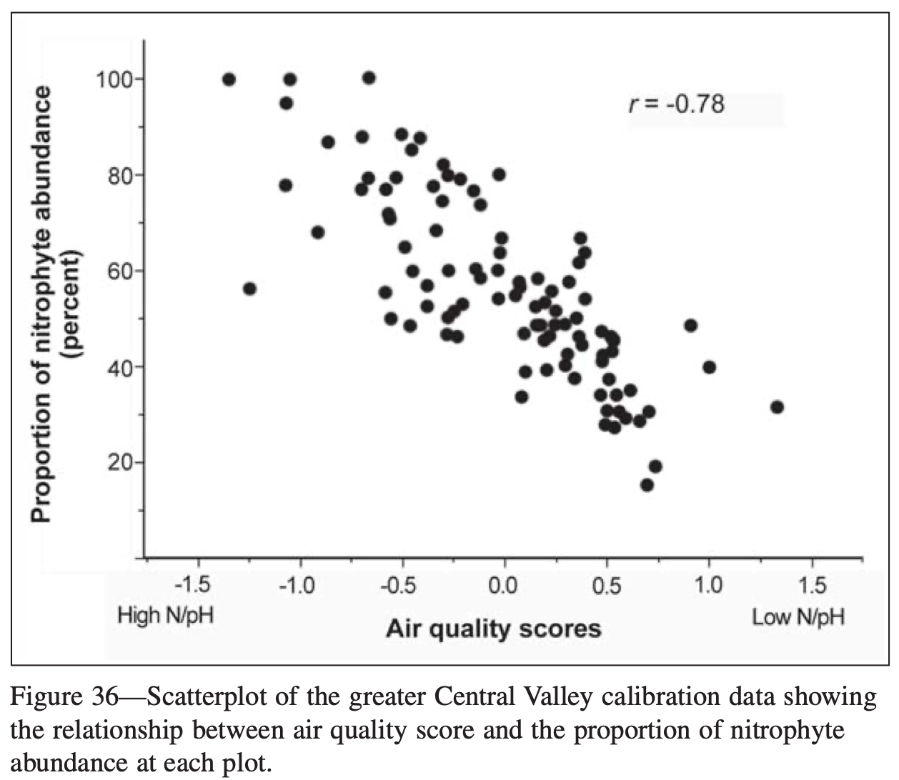
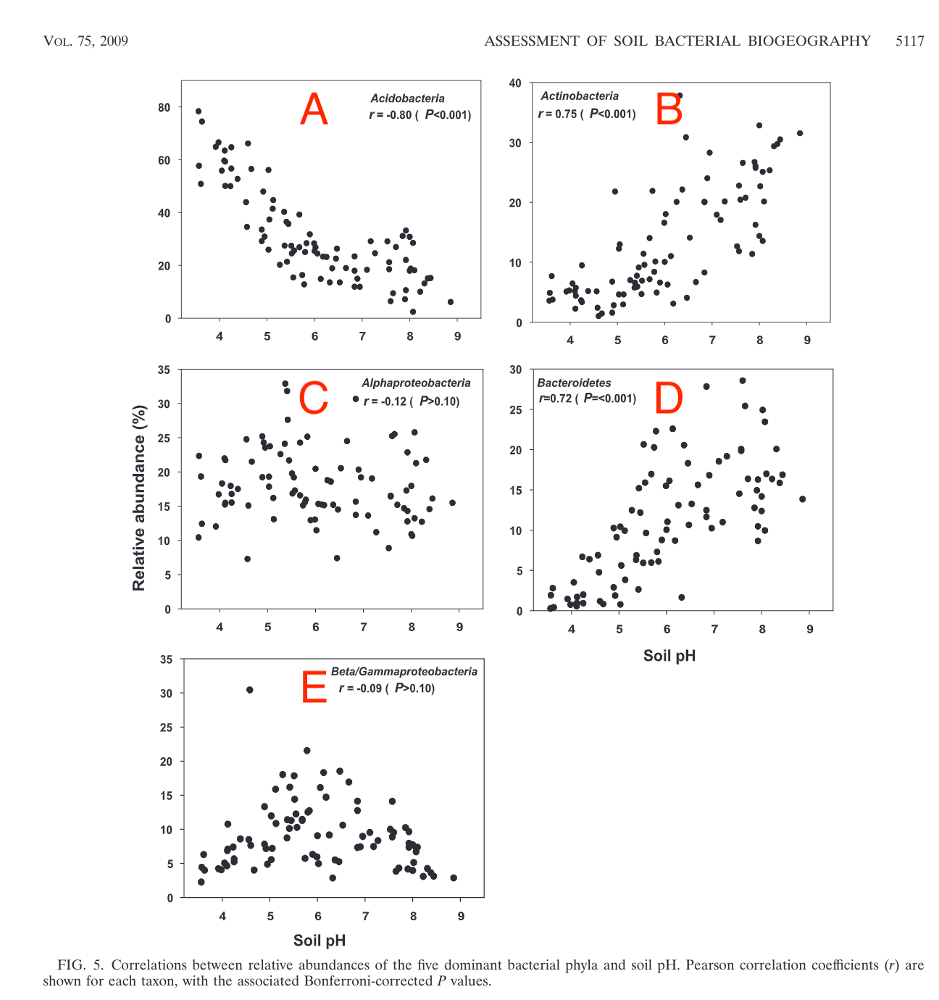
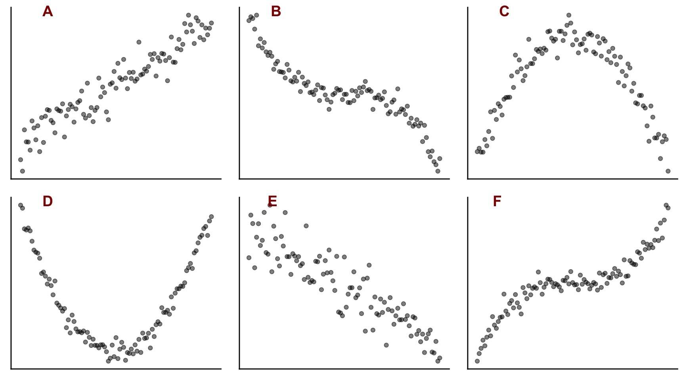

# Correlation


This guide to correlation is heavily based on the very helpful chapter in Statistics, by David Freedman, Robert Pisani, Roger Purves and Ani Adhikari, 2nd ed., Norton.


The notable statistician Karl Pearson (1857 - 1936) carried out a study to investigate the resemblance between children and their parents. As part of the study, Pearson measured the heights of 1078 parents and of their children at maturity. The heights of the children are plotted against the heights of the parents in the plots below, where we distinguish between father-son and mother-daughter pairs.



The taller a father, the taller his sons tend to be. It is the same with mothers and daughters.

There is a positive association between a father's height and the height of his sons.

But there is a lot variation - the association is weak.

If you know the height of a father, how much does that tell you about the height of his sons?

Consider fathers who are about about 67 inches tall, and look at the wide variation in the heights of their sons - - all the points between the two vertical dotted lines. The same is true for the daughters of mother who are about 63 inches tall.

If there is a strong association between two variables, then knowing one helps a lot in predicting the other. But when there is a weak association, information about one variable does not help much in guessing the other. When there is no association, it does not help at all.

## The correlation coefficient

Suppose we are looking at the relationship between two variables and have already plotted the scatter plot. The graph looks like a cloud of points.

How can we summarise it numerically?

The first thing we can do is to mark a point that shows the average of the *x*-values and the average of the *y*-values. This is the *point of averages*. It marks the centre of the cloud.

The next step is to measure the width of the cloud from side to side, in both the *x* and the *y* directions. This can be done using the standard deviations (SD) of the *x* and *y* values. Remember that if both *x* and *y* are normally distributed, then 95% of the data will lie within about 2 (1.96 if we want to be pernickety) standard deviations of the mean, in each direction.




So far, our summary statistics are:

-   mean of the *x* values, SD of the *x* values.
-   mean of the *y* values, SD of the *y* values.

These statistics tell us where the centre of the cloud is and how far spread out it is both vertically and horizontally, but they do not tell the whole story.

Consider the following two sets of data plotted below. Both have the same centre and the same spread.




However the points in the first cloud are tightly clustered around a line - there is a strong linear association between the two variables. In the second cloud, the clustering is much looser. The strength of the association is different in the two diagrams. To measure the association, one more summary statistic is needed - the *correlation coefficient*.

This coefficient is usually abbreviated as *r*, for no good reason.

------------------------------------------------------------------------

The correlation coefficient is a measure of linear association or clustering around a line. The relationship between two variables can be summarized by:

-   the average of the *x*-values, the SD of the *x*-values.
-   the average of the *y*-values, the SD of the *y*-values.
-   the correlation coefficient *r*

------------------------------------------------------------------------

## Different values of *r*.

Let us see how this looks graphically. In the Figure below we show six scatter plots for hypothetical data. In all six pictures the average is 3 and the standard deviation is 1 for both *x* and *y*. The correlation coefficient is printed in each case.




The one top left shows a correlation of 0 and the cloud is completely formless. As *x* increases, *y* shows no tendency to increase or decrease. It just straggles around.

The next diagram has *r* = 0.4 and a linear pattern is just starting to emerge. The next has *r* = 0.6 with a stronger linear pattern, and so on. The closer *r* is to 1 the stronger is the linear association and the more tightly clustered are the points around a line.

A correlation of 1, which does not appear in the Figure is often referred to as a *perfect correlation*. It means that all the points lie exactly on a line so there is a perfect linear correlation between the two variables. Correlation coefficients are always between -1 and 1.

The correlation between the heights of identical twins is around 0.95. A scatter diagram for the heights of twins would thus look like the bottom right diagram in the Figure. We see that even with a coefficient this big there is a still a fair degree of scatter. The heights of identical twins are far from being equal all the time.

Real data in the life sciences never shows perfect correlation and rarely does it even show strong correlation. It is more common for it to look like Pearson's father-son data, with weak associations and *r* values in the range 0.3 to 0.7. This is even more true for data from the social sciences which concern human behaviour.

We can also have negative associations between variables. For example women with more education tend to have fewer children. Animals with higher body weight tend to have lower metabolic rates. As one variable increases, the other decreases. When there is negative association, the correlation coefficient has a negative sign.

Below we show six examples of negative correlation. As in the previous figure, all the data sets have a mean of 3 and a standard deviation of 1.




------------------------------------------------------------------------

Correlations are always between -1 and 1, but can take any value in between. A positive correlation means that the cloud slopes up: as one variable increases, so does the other. A negative correlation means that the cloud slopes down. As one variable increases, the other decreases.

------------------------------------------------------------------------

## Using R to find the correlation coefficient.

First, let us try to find the correlation between two sets of data where we know what the correlation coefficient is, because we created the data ourselves. We will take the *x* and *y* data used above for which the correlation coefficient was fixed to be 0.8


```r
cor.test(x,y,method="pearson")
```

```
## 
## 	Pearson's product-moment correlation
## 
## data:  x and y
## t = 9.2167, df = 48, p-value = 3.412e-12
## alternative hypothesis: true correlation is not equal to 0
## 95 percent confidence interval:
##  0.6700910 0.8815519
## sample estimates:
##      cor 
## 0.799346
```

There are different ways to calculate the correlation coefficient. Which of them is appropriate depends mainly on the type of data, and if they are numeric, whether they are normally distributed. If they are, then we use the Pearson method. If they are not, for example because they are ordinal data, then we use the Spearman's Rank method and write *method="spearman"* instead. In this case we can relax the requirement that there is a linear association between the data sets, but there does still need to be a monotonic relationship. 

It is important to be able to interpret and report the output.

First, understand that R is carrying out a test, the null hypothesis of which is that there is no correlation between the values of *x* and the values of *y* among the populations from which the *x* and *y* data were drawn, so that the correlation coefficient between *x* and *y* within those populations is zero. It then reports a *p*-value: how likely it is that you would have got the data you got for this sample of data if that null hypothesis were true. As with most tests, to do this it uses the data to calculate a so-called *test-statistic*. How it does this need not concern us here. The details will differ from test to test, and the name given will differ. Here it is called *t*. It also reports the number of independent pieces of information used to calculate that statistic. This is called the *degrees of freedom*, here denoted *df*. This usually (but not necessarily) has a value that is 1,2 or 3 less than the number of data points.

Then it reports the *p*-value. A tiny (close to zero) value here means that it thinks it very unlikely that the samples would be as they are if the *x* and *y* variables were not correlated in the populations from which the samples were drawn. A high (by which we usually mean greater than 0.05) value means that there is a reasonable chance that the actual non-zero correlation coefficient could have been found between *x* and *y* in the samples, even though those values were not correlated in the wider populations from which the samples were drawn. In that case we would have found no evidence that the *x* and *y* data within the population were correlated. This doesn't mean that they aren't, just that we have insufficient evidence to reject the null hypothesis that they are not.

The *p*-value reported here is 4.3e-12. That is R's way of saying what in standard form would be written 4.3 x 10^-12^. This is a really tiny value. It is 0.0000000000043, which is a very inconvenient way to write such a small number. Hence R's way of doing it or the standard form way of doing it. In the context of a statistical test and when *p* is is that small we don't care about its exact value, we simply note that it is very, very small. We thus can confidently reject the null hypothesis and assert that the data provide evidence that *x* and *y* are correlated, in this case positively.

Further, it reports the actual correlation coefficient. Here it finds *r*=0.797, which we happen to know to be correct because we created this data set ourselves, and a 95% confidence interval for the coefficient. The precise meaning of the confidence interval is subtle, but it is a kind of error bar for the correlation coefficient *r*. It means that if we drew sample after sample from the population and calculated the confidence interval for *r* for each sample, then 95% of the time that interval would capture the true value of *r*.

If the *p*-value is small enough that we reject the null-hypothesis, then this confidence interval should not encompass zero. If the *p*-value is large enough that we do not reject the null hypothesis then this confidence interval *will* encompass zero.

Here, the confidence interval is from 0.67 to 0.88. This does not encompass zero. In fact it is far from zero, so is consistent with our finding a really small *p*-value.

To report the result of this test we would say something like:

> We find evidence for a strong positive correlation between *x* and *y* (Pearson *r* =0.80, *t*=9.1, *df*=48, *p*\<0.001)

Note that when the *p*-value is much less than 0.05 as it is here we do not normally report its exact value, but simply write *p*\<0.01, or *p*\<0.001, and so on. The point is that these ways of reporting it tell the reader that *p* is *way* less than 0.05. This is all they need to know to see that we can confidently reject the null hypothesis.

### Correlations for real data

Let us look at the Iris data set that is built into R. It contains values for the Sepal Width, Sepal Length, Petal Width and Petal Length for samples of 50 plants from each of three species of Iris, *setosa*, *versicolor* and *virginica*. Here are the first few rows:


```
##   Sepal.Length Sepal.Width Petal.Length Petal.Width Species
## 1          5.1         3.5          1.4         0.2  setosa
## 2          4.9         3.0          1.4         0.2  setosa
## 3          4.7         3.2          1.3         0.2  setosa
## 4          4.6         3.1          1.5         0.2  setosa
## 5          5.0         3.6          1.4         0.2  setosa
## 6          5.4         3.9          1.7         0.4  setosa
```


We will look to see if the data allow us to reject the idea that petal width and petal length are not correlated within the wider populations of each of these species:

First, let's plot the data


```r
iris |>
  ggplot(aes(x=Petal.Width,y=Petal.Length,colour=Species)) +
  geom_point() +
  labs(x="Petal Width (mm)",
       y="Petal Length (mm)") +
  facet_wrap(~Species,nrow=1,scales="free") +
  theme_classic() +
  theme(legend.position="none") +
  theme(strip.background=element_blank())
```



Having seen the plots, do you think that petal width and length are correlated in these samples, and roughly what value for *r* do you expect in each case?

Looking at each graph, it appears that there is a positive correlation for each species, but that this is weaker for *setosa* and *virginica* than it is for *versicolor*. Knowing the petal width for that species gives you a much better idea of the petal length, and vice-versa, than is true for the other two species.

Let us find out:


```r
iris |>
  group_by(Species) |>
  summarise(r=cor.test(Petal.Width,Petal.Length)$estimate,
            lower.boundb=cor.test(Petal.Width,Petal.Length)$conf.int[1],
            upper.bound=cor.test(Petal.Width,Petal.Length)$conf.int[2],
            "p value"=cor.test(Petal.Width,Petal.Length)$p.value) |>
  kbl(digits=3) |>
  kable_styling(full_width=0.7)
```

<table class="table" style="margin-left: auto; margin-right: auto;">
 <thead>
  <tr>
   <th style="text-align:left;"> Species </th>
   <th style="text-align:right;"> r </th>
   <th style="text-align:right;"> lower.boundb </th>
   <th style="text-align:right;"> upper.bound </th>
   <th style="text-align:right;"> p value </th>
  </tr>
 </thead>
<tbody>
  <tr>
   <td style="text-align:left;"> setosa </td>
   <td style="text-align:right;"> 0.332 </td>
   <td style="text-align:right;"> 0.059 </td>
   <td style="text-align:right;"> 0.558 </td>
   <td style="text-align:right;"> 0.019 </td>
  </tr>
  <tr>
   <td style="text-align:left;"> versicolor </td>
   <td style="text-align:right;"> 0.787 </td>
   <td style="text-align:right;"> 0.651 </td>
   <td style="text-align:right;"> 0.874 </td>
   <td style="text-align:right;"> 0.000 </td>
  </tr>
  <tr>
   <td style="text-align:left;"> virginica </td>
   <td style="text-align:right;"> 0.322 </td>
   <td style="text-align:right;"> 0.048 </td>
   <td style="text-align:right;"> 0.551 </td>
   <td style="text-align:right;"> 0.023 </td>
  </tr>
</tbody>
</table>

The table gives the estimated value for the Pearson correlation coefficient in each case, the lower and upper bound of the confidence interval for that coefficient and the *p*-value.

Do these output provide evidence for a correlation between petal length and petal width in each case?

## The correlation coefficient measures the degree of linear association.

Sometimes the Pearson correlation coefficient *r* is a poor measure of the degree of association within a data set. Outliers and non-linearity are two problem cases.

Consider first a data set where there is a very strong association between variables, but where the data sset contains an outlier, and then a data set where there is a strong but non-linear association between variables. Here we mean by 'strong' that knowing the value of one variable gives you a very good idea of the value of the other.



The outlier in the left-hand figure above brings the correlation coefficient down to 0.08, which is close to zero. The correlation coefficient in the right-hand figure is similarly small at -0.279, despite that there is a strong association between the *x* and *y* data. The reason is that the association is non linear.

### When is it appropriate to calculate a correlation coefficient?
So, we note that the correlation coefficient is a measure of *linear* association, not of association in general. At least, this is true if you are calculating the Pearson correlation coefficient. If your data are not suitable for that and you decide to calculate the Spearman's Rank correlation coefficient, then the condition is relaxed somewhat: there might be but there no longer *needs* to be a linear relationship between the two variables, but there must be a *monotonic* one. That means that, as one variable increases, the other should either increase or remain constant, or decrease or remain constant - that is, there should be no peaks or troughs in the data.


## Association is not causation

A very important and often-repeated point to note is that correlation measures association. But association is not the same as causation. 

See [Spurious Correlations](https://www.tylervigen.com/spurious-correlations) for some amusing examples.

## Examples

### Lichen abundance

::: csl-entry
Jovan, S. (2008). <i>Lichen Bioindication of Biodiversity, Air Quality, and Climate: Baseline Results From Monitoring in Washington, Oregon, and California</i>. <http://gis.nacse.org/lichenair/doc/Jovan2008.pdf>
:::



There is a strong negative correlation (*r*=-0.78) between air quality score and proportion of nitrophyte lichen. This suggests that this proportion can be used as a bioindicator of air quality.

### Soil bacteria

::: csl-entry
Lauber, C. L., Hamady, M., Knight, R., & Fierer, N. (2009). Pyrosequencing-based assessment of soil pH as a predictor of soil bacterial community structure at the continental scale. <i>Applied and Environmental Microbiology</i>, <i>75</i>(15), 5111--5120. <https://doi.org/10.1128/AEM.00335-09>
:::



In the Figure above, note that the *r*-values for **C** and **E** are close to zero, and the *p*-values are greater than 0.1, meaning that at this significance level there is no evidence from these data that there is *any* linear association between soil pH and the relative abundances of *Alphaproteobacteria* or *Beta/Gammaproteobacteria*. From the plots, it looks in **C** as if there no assocation at all, whereas in **E** it looks as though there might be, but if so then not a linear association, for which the correlation coefficient r would be a poor measure.

## Exercises  

### Exercise 1



Plots A to F above show scatter plots of different data sets _Y_ against _X_. 

* Which of them show linear behaviour?
* Which of them show monotonic behaviour?
* For which of them might it be appropriate to calculate the following correlation coefficients between _X_ and _Y_?
  * Pearson *r*
  * Spearman rank *r*~sp~


### Exercise 2

Open a new R notebook

In the usual way, include to start with code chunks to


1.  Load the packages needed `tidyverse` and  `here`.
3.  Read the data set `iris.csv` (which should be in your data folder already) into an object called `iris`

You can do this with this code chunk:

````
```{r}     
filepath<-here("data","iris.csv")
iris<-read_csv(filepath)
glimpse(iris)
```
````

4.  Create a faceted plot of sepal length against sepal width for each species.

5.  Calculate the Pearson correlation coefficient between sepal length and sepal width for each species, and display this, plus the lower and upper bounds of the confidence interval and the *p*-value for each species in a table.

For (4) and (5) you can adapt code used on the previous tab.

Now:

-   Does it appear that the sepal length and sepal width are correlated for each species?\
-   Is the correlation positive or negative?\
-   For which species is the correlation strongest?\
-   Do the correlation coefficients make sense, given the plots?
