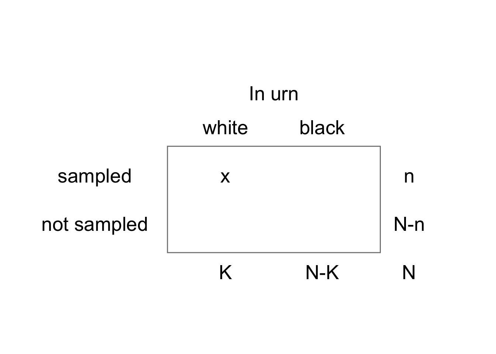

# Fisher's exact test


Fisher's Exact Test can be used in place of a chi-square test for independence in cases where counts are too low to make the chi-square approximation appropriate for calculating a *p*-value.  A rule of thumb often used for this is that a chi-square test is no longer reliable when there are fewer than five or so counts in every cell of the contingency table.

Ronald Fisher devised an exact test now named after him that could be used for this scenario in situations where the marginal totals (ie row totals and column totals) of the table were fixed by the experimenter.

Say we were devising a phone app that we hoped could  distingush between two visually similar species of grass given a photo. In an experiment, we show the app 10 cases of species A and 10 of species B and in each case we record the identification decision of the app. That will give four possibilities.

* species is A, app identifies it as A
* species is A, app identifies it as B
* species is B, app identifies is as B
* species is B, app identifies it as A

The counts of these decisions can be recorded in a two-way, in this case $2 \times 2$, table, in which each cell contains the counts recorded for each combination of the levels of each factor. In a test run, suppose the numbers recorded for each case were as follows:


Here we see that the row totals are set by the experimenter while the column totals are set by the app.  Thus we see that the app is slightly more likely to choose A than B, regardless of the actual identity of the plant, since it went for A 11 times out of 20, and for B only 9 times.

Our **null hypothesis** might be:

The app has no ability to correctly distinguish species A from species B. 

We should not use a chi-square test for independence here since the numbers in two of the cells are less than 5. 

In the Fisher's Exact Test, we accept that the marginal totals are as observed. With this constraint we then determine the probability of getting every possible table of cells, under the null hypothesis that the two factors are independent of each other. The *p*-value for (lack of) independence of the two variables is then the cumulative sum of the probabilities of getting the table we actually got, plus those of tables that are even less likely. That is just what *p*-values are - the probabiliy of gettting the data you got, or more extreme data, *if* the null hypothesis is true.

To do this, we notice that if the column and row totals have been fixed in advance, then only one of the cell values of the table is independent. We can choose any cell. Once this is known, all the others can be determined, using this first value and the marginal totals. It turns that we can treat this number as a random variable that varies with probabilities governed by the **hypergeometric** distribution. We can thus use this distribution to calculate the probability of getting any possible table, given the row and column totals.

Let's see how this works.

## The Hypergeometric Function

Imagine an urn with *N* balls, *K* of them white, the rest, *N*-*K* of them, black. 

Draw a sample of *n* balls *without* replacement - that is, don't put a ball back in the urn once it has been taken out.

Let *x* be the number of white balls in the sample.



*x* is a random variable that follows a *hypergeometric* (*N*, *K*, *n*)  distribution:


$$
\text{P}(X=x)=\frac{{K \choose x} {{N-K} \choose {N-x}}}{N\choose n}
$$

Here, terms like $K\choose x$ refer to the number of ways that *n* objects can be chosen from a collection of *N* objects. For details, see any book on proability, but the deatils need not concern us here. This tells us the probability that we will get *x* white balls if we draw *n* balls without replacement (each ball that is drawn is not put back) from an urn that at first contains *N* balls, *K* of them white.

For example, if we have an urn with *N* = 20 balls, *K* = 11 of them white, the remaining *N* - *K* = 9 of them black, and draw *n* = 10 balls without replacement, the probability that *x* = 7 of these will be white is given by

$$
\begin{align*}
N=20, K&=11, n=10, x=7\\
\\
\text{P}(X=7)& =\frac{{K \choose x} {{N-K} \choose {N-x}}}{N\choose n}\\
&=\frac{{11 \choose 7} {{20-11} \choose {20-7}}}{20\choose 10}\\
&= 0.014
\end{align*}
$$
Here, we calculated the probability of getting $x$ *given* the number $K$ of white balls in the urn, which is one column total of the table, the number $n$ of balls that were sampled, which is one row total, and the total number $N$ of balls in the urn. Given these three numbers we know the other column total, which must be $N-K$, and the other row total which must be $N-n$. These are the numbers of balls that were not sampled and the number of black balls in the urn, respectively.

Further, given that these row and column totals are all known, if we get $x$ white balls among the $n$ balls that we take from the urn, we also know the other three values in the table. That is we know the number of black balls that came out, and the numbers of white and black balls that must still be in the urn. 

In other words, when we calculate the probability of getting a particular number $x$ of white balls from the urn, out of $n$ that we drew altogether, given that the urn contains $K$ white balls and $N$ balls altogether, we are calculating the probability of getting a particular set of four values in the $2 \times 2$ table.

Note too that when balls are sampled from the urn we do not preferentially sample white or black balls: we would expect the ratio of colours sampled to be roughly equal to the ratio of colours actually in the urn. 

This is precisely the scenario for our app data under the null hypothesis of no association between the truth and the app's decision. We know how many times it decided on Species A (ie we know one column total of our table, let's call it $K = 11$), we know how many seedlings of species A we actually had (so that's one row total, let's call it $n = 10$) and we know how many seedlings we had altogether: $N = 20$. Therefore, just as with the urn, we also know the other row and column totals, which must be 10 and 9 respectively. We find that the app decided on species A just 3 times. Convince yourself that knowing all these numbers means that the other entries in the table (top right, and the bottom row) are now also known. 

Thus if we want to calculate the probability of getting precisely this table, that will be the same as the probability of deciding there were 3 white seedlings since that number fixes the other three entries in the table.

And finally, and more precisely, if we want to calculate the probability of our app getting this table of results *given* that its decision for any seedling is independenty of the truth for that seedling, then we have exactly the same set-up asfor the urn, and we can use the hypergeometric function to calculate the probability of getting any particular table of results.

In case you are worried, *we* will not normally use the hypergeometric function directly, nor de we even need to know it is being used. We can use the R runction `fisher.test()`: see below.

## Hypergeometric Distribution in R

However if you are interested in the hypergeometric function, it is catered for in R like many other distributions by a family of four functions: 

* `dhyper(x, m, n, k)`. 
* `phyper(q, m, n, k)`. 
* `qhyper(p, m, n, k)`. 
* `rhyper(nn, m, n, k)`. 


where, in R:

* m = number of white balls in urn   
* n = number of black balls in urn. 
* k = number of balls sampled (without replacement). 
* x = number of white balls in sample. 
* nn= number of balls in urn = m + n

For further information on the use of any of these, type the name of the function preceded by a question mark into the console pane, bottom left. Help will then appear in the Help pane, bottom right.

In our example, to calculate the probability of a given table of results, 

dhyper(r1c1, col1, nn-col1, row1)

## Back to Fisher's Exact Test

First we will go through all the steps manually just so you can see what is going on under the hood of a Fisher's Exact Test, then we will do the test in R.

In this test we

* Assume the null hypothesis (independence) to be true. 
* Constrain the marginal counts to be as observed   
* Calculate the probability of the observed table, given the null hypothesis

In the case of the example, that means that we should calculate

$$
P(\text{observed table}|H_0) = P(X=7|H_0)\\
X ∼ \text{Hypergeometric} (N=20, K=11, n=10)
$$
and then

* In the same way we calculate the probabilities of all possible tables, given the constraints of the marginal totals, then we
* Sum the probabilities of all tables that are as or more 'extreme' than the observed table ie whose probability is less than or equal to that of the  observed table. 
* The resulting sum is the *p*-value of the observed table, given the marginal totals.  
* If this *p*-value is less than a predetermined threshold value (the value chosen is usually 0.05) then we reject the null hypothesis and regard the data as providing evidence for an association between the factors. That is we reject the idea that they are independent of each other. In the case presented above, that means we reject the idea

## Example

In the figure below we show all possible tables, along with their respective *p*-values, calculate using the hypergeometric function. The table of the actual results obtained is picked out in colour. We see that tables 


We see that tables a), b), c), h) (the actual results), i) and j) all have *p*-values equal to or less than that of the actual results. The combined total of these *p*-values is 0.06978.

This *p*-value is bigger than 0.05 so we would normally fail to reject the null hypothesis that there is no association between the two factors. There is no evidence from these data that the app does any better than guessing  whether a plant is species A or species B!

## Fisher's Exact Test in R

If we already know the four counts for our $2 \times 2$ table we can create a $2 \times 2$ matrix of them like this:


```r
app.mat <- matrix(c(3,8,7,2),nrow=2)
app.mat
```

```
##      [,1] [,2]
## [1,]    3    7
## [2,]    8    2
```

If we had the data in a tidy data frame like we had for the ladybird data we can convert it into a matrix using the `xtabs()` command in the same way as we did there.

We use this matrix as the argument of the `fisher.test()` function:


```r
fisher.test(app.mat)
```

```
## 
## 	Fisher's Exact Test for Count Data
## 
## data:  app.mat
## p-value = 0.06978
## alternative hypothesis: true odds ratio is not equal to 1
## 95 percent confidence interval:
##  0.007870555 1.133635839
## sample estimates:
## odds ratio 
##  0.1226533
```
That's it! It's a one liner, just like many statistical tests in R. You will see that this gives the same *p*-value that we have calculated manually.

## What if we just use a chi-square test?

If we use a chi-square test on this same data, R gives us a warning, because of the low values in the table:


```
## Warning in stats::chisq.test(x, y, ...): Chi-squared approximation may be
## incorrect
```

```
## 
## 	Pearson's Chi-squared test with Yates' continuity correction
## 
## data:  app.mat
## X-squared = 3.2323, df = 1, p-value = 0.0722
```

This is a cautionary tale: you can use R to run this or that test on data even when the data are unsuitable for the test, and you will get an output, but the output may not be reliable. Here, at least, we are given a warning that alerts us to this possibility, and in fact our conclusion would be the same as it was when using the Fisher's Exact Test, but that is not always the case. You need to think carefully as to whether a given test is the right one *before* you use it.


## Why not always use Fisher's Exact Test instead of a chi-square test?

Fisher's Exact Test becomes computationally expensive when the number of tables for which a *p*-value has to be calculated becomes very large. This happens very quickly when each of the two factors has more than two levels, so that the contingency table is no longer $2 \times 2$ but $3 \times 4$ or $4\times 6$ and so on. However for $2 \times 2$ tables it works well and quickly for table cell values into the 1000s and is a perfectly valid alternative to the chi-squared test. But then, in that case, why not just use a chi-squared test? For large cell values this works well and anyone reading your work is more likely to be familiar with it than with the Fisher's Exact Test.

## Another Cautionary Note

This leads us to think that the Fisher's Exact Test is only really a better alternative to the chi-squared test when sample sizes are very small and the chi-squared approximation becomes invalid. However, think about it. If you have a small sample then it is likely that it is not very representative of the population from which it has been drawn, and that you will fail to detect any association that there may be between the two factors. The solution therefore, when you have a small sample, is likely not to say Hallelujah! and grasp the Fisher's Test with glee, but, if you can, to get a bigger sample. However, if that is not possible and you are stuck with a small sample size, then a Fisher's Exact Test of independence is more reliable than a chi-squared test.

