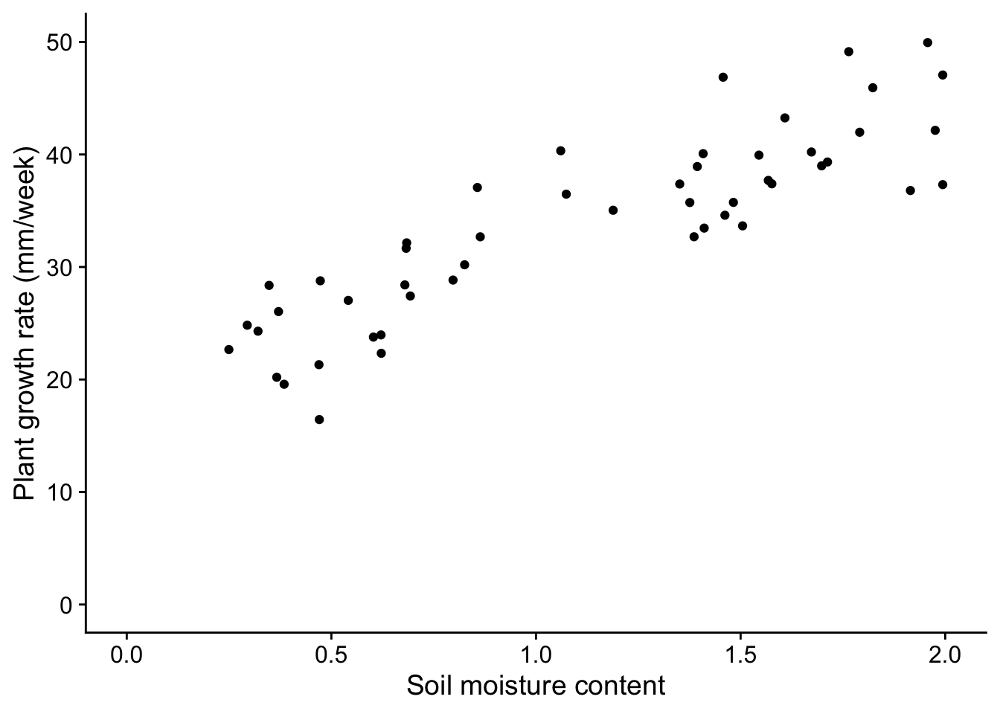
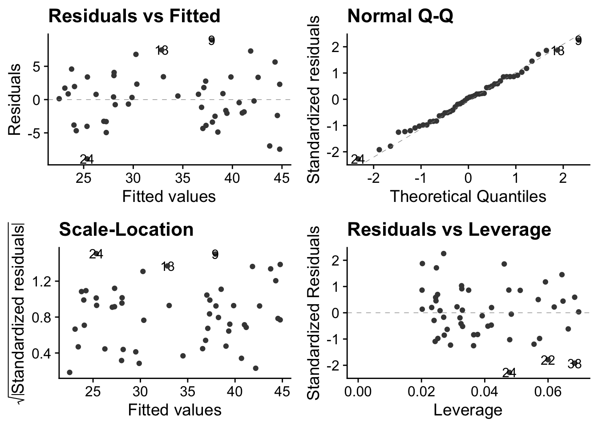
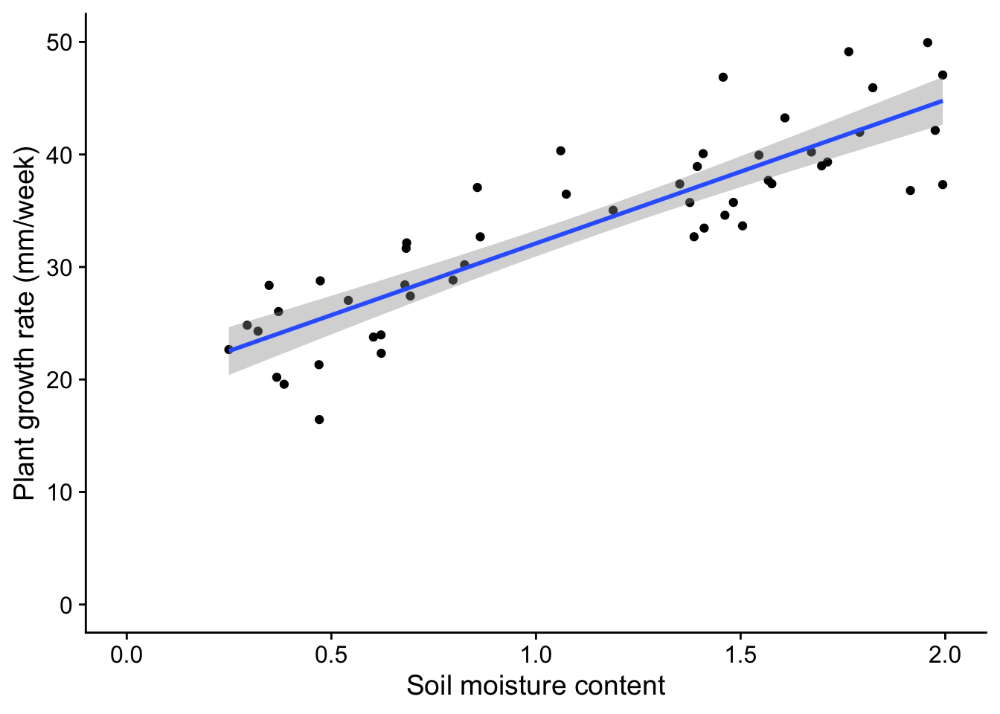

# Simple linear regression {#linear-regression}


A class of analytical models that you will use this year and next go under the name **General Linear Models**. They include linear regression, multiple regression, ANOVA, ANCOVA, Pearson correlation and t-tests.

Despite appearances, these models are all fundamentally linear models. They share a common framework for estimation (least squares) and a common set of criteria that the data must satisfy before they can be used. These criteria centre around the idea of normally distributed residuals. An important stage of any analysis that uses linear models is that these assumptions are checked, as part of the *Plot* -> *Model* -> *Check Assumptions* -> *Interpret* -> *Plot again* workflow.

Here, we will go through an example of simple linear regression - suitable for trend data where we wish to predict a continuously varying response, given a value of a continuous explanatory variable. As we go we show code snippets from an R script that does this job, and, at the bottom, an example complete script that you could adapt to your own needs.

## Simple Linear Regression

As an example, we ask the question: does plant growth rate depend on soil moisture content?

We predict that more moisture will probably allow higher growth rates. We note that this means there will be a clear relationship between the variables, one that should be apparent if we plot the response (dependent) variable - plant growth rate - against the explanatory (independent) variable - soil moisture content. We note that both the explanatory variable and the dependent variables are *continuous* - they do not have categories.

What we want to do in linear regression is be able to predict the value of the dependent variable, knowing the value of the independent variable. In practice, this means drawing a 'best fit' straight line through the data and determining the intercept and gradient of this line.


## Load packages

```r
library(tidyverse)
library(here)
library(ggfortify)
library(cowplot)
# un-comment and run the next line if you have not yet installed mbhR.
# remotes::install_github("mbh038/mbhR")
library(mbhR)
```

## Get the data
We have a data set to explore our question: The `plants` data set is available through the `mbhR` package which you have already installed and loaded


```r
data(plants)
glimpse(plants)
```

```
## Rows: 50
## Columns: 2
## $ soil.moisture.content <dbl> 0.4696876, 0.5413106, 1.6979915, 0.8255799, 0.85…
## $ plant.growth.rate     <dbl> 21.31695, 27.03072, 38.98937, 30.19529, 37.06547…
```
We see that the data set contains two continuous variables, as expected.

## Plot the data

We can use the package `ggplot2`, which is part of `tidyverse` to do this:


```r
plants |>
  ggplot(aes(x=soil.moisture.content, y=plant.growth.rate)) +
  geom_point() +
  labs(x="Soil moisture content",
       y="Plant growth rate (mm/week)") +
  xlim(0,2) +
  ylim(0,50) +
  theme_cowplot()
```



From the plot, we note that:

* there is an upward trend that is plausibly linear within this range of soil misture content. The more moisture there is in the soil, the greater the growth rate of the plants appears to be.
* the variance of the data, that is the range of vertical spread is approximately constant for the whole range of soil moisture content. This is one of the key criteria that data must satisfy if we are to analyse them using a linear model such as simple linear regression.
* we can estimate the intercept and gradient of a best fit line just by looking at the plot. Roughly speaking, the moisture content varies from 0 to 2, while the growth rate rises from 20 to 50, a rise of about 30. Hence the gradient is about 30/2 = 15 mm/week, while the intercept is somewhere between 15 mm and 20 mm / week.

It is always good practice to examine the data before you go on to do any statistical analysis.

## Make a simple model using linear regression

We use the function `lm()` to do this, and we save the results in an object to which we give the name `model_pgr`. This function needs a formula and some data as its arguments:


```r
model_pgr<-lm(plant.growth.rate ~ soil.moisture.content, data = plants)
```

This reads: 'Fit a linear model, where we hypothesize that plant growth rate is a function of soil moisture content, using the variables from the `plants` data frame.'

## Check assumptions

Before we rush into interpreting the output of the model, we need to check whether it was valid to use a linear model in the first place. Whatever the test within which we are using a linear model, we should do the necessary diagnostic checks at this stage.

You can do this using tests designed for the purpose, but I prefer to do it graphically, using a function `autoplot()` from the package `ggfortify`. You give this the model we have just created using `lm()` and it produces four very useful graphs. I suggest that, after once installing `ggfortify` you include the line `library(ggfortify)` at the start of every script.

Here is how you use it:


```r
autoplot(model_pgr, smooth.colour=NA) + theme_cowplot()
```



The `theme_cowplot()` part is not necessary, but it gives the plots a nice look, so why not?

These plots are all based around the `residuals', which is the vertical distance between observed values and fitted values ie between each point and the best fit line through the points - the line which the linear model is finding for us, by telling us its intercept and gradient.

Note that in simple linear regression, the best fit line is the one that minimises that sum of the squared residuals.

So what do these plots mean?

* *Top-left*: This tells you about the structure of the model. Was it a good idea to try to fit a straight line to the data? If not, for example because the data did follow a linear trend, then there will be humps or troughs in this plot.
* *Top-right*: This evaluates the assumption of normality of the residuals. The dots are the residuals and the dashed line is the expectation under the normality assumption. This is a *much* better way to check normality than making a histogram of the residuals, especially with small samples.
* *Bottom-left*: This examines the assumption of equal variance of the residuals. A linear model assumes that the variance is constant over all predicted values of the response variables. There should be no pattern. Often, however, there is. With count data, for example, the variance typically increases with the mean.
* *Bottom-right*: This detects leverage - which means points that have undue influence on the gradient of the fitted line, and outliers. If you have outliers in your data, you need to decide what to do with them.

In the case of these data, we are good to go! There is no discernible pattern in either of the left-hand plots, the qq-plot is about as straight as you ever see with real data, and there are no points exerting undue high influence.

## Interpretation of the model

Now that we have established that the data meet the criteria required for the model to be valid, we can go ahead and inspect its output. We will do this using two tools that we also use for every other general linear model we implement (t-test, ANOVA etc). These are `anova()` and `summary()`

Let us first use `anova()`:


```r
anova(model_pgr)
```

```
## Analysis of Variance Table
## 
## Response: plant.growth.rate
##                       Df  Sum Sq Mean Sq F value    Pr(>F)    
## soil.moisture.content  1 2521.15 2521.15  156.08 < 2.2e-16 ***
## Residuals             48  775.35   16.15                      
## ---
## Signif. codes:  0 '***' 0.001 '**' 0.01 '*' 0.05 '.' 0.1 ' ' 1
```
The F value here is an example of a 'test statistic', a number that a test calculates from the data, from which it is possible to further calulate how likely it is that you would have got the data you got if the null hypothesis were true. This particular test statistic is the ratio of the variation in the data that is explained by the explanatory variable to the leftover variance. The bigger it is, the better the job that the explanatory variable is doing at explaining the variation in the dependent variable. The p value, which here is effectively zero, is the chance you would have got an F value this big or bigger from the data in the sample if in fact there were no relationship between plant growth rate and soil moisture content. If the p value is small (and by that we usually mean less than 0.05) then we can reject the null hypothesis that there is no relationship between plant growth rate and soil moisture content.

Hence, in this case, we emphatically reject the null: there is clear evidence that plant growth rate is at least in part explained by soil moisture content.

Now we use the `summary()` function:


```r
summary(model_pgr)
```

```
## 
## Call:
## lm(formula = plant.growth.rate ~ soil.moisture.content, data = plants)
## 
## Residuals:
##     Min      1Q  Median      3Q     Max 
## -8.9089 -3.0747  0.2261  2.6567  8.9406 
## 
## Coefficients:
##                       Estimate Std. Error t value Pr(>|t|)    
## (Intercept)             19.348      1.283   15.08   <2e-16 ***
## soil.moisture.content   12.750      1.021   12.49   <2e-16 ***
## ---
## Signif. codes:  0 '***' 0.001 '**' 0.01 '*' 0.05 '.' 0.1 ' ' 1
## 
## Residual standard error: 4.019 on 48 degrees of freedom
## Multiple R-squared:  0.7648,	Adjusted R-squared:  0.7599 
## F-statistic: 156.1 on 1 and 48 DF,  p-value: < 2.2e-16
```
This gives us estimates of the intercept (19.348) and gradient (12.750) of the best fit line through the data. The null hypothesis is that both these values are zero, and the p-value is our clue as to whether we can reject this null. Here, in both cases, we clearly can.

We also see the *Adjusted R-squared* value of 0.7599. This is the proportion of the variance in the dependent variable that is explained by the explanatory variable. Thus it can vary between 0 and 1. A large value like this indicates that soil moisture content is a good predictor of plant growth rate.

## Back to the figure
Typically, a final step in our analysis involves including the model we have fitted into the original figure, if that is possible in a straightforward way. In the case of simple linear regression, it is. It  means adding a straight line with the intercept and gradient displayed by the `summary()` function. We do this by adding a line `geom_smooth(method = "lm")` to our plot code:


```r
plants |>
  ggplot(aes(x=soil.moisture.content, y=plant.growth.rate)) +
  geom_point() +
  geom_smooth(method = "lm") +
  labs(x="Soil moisture content",
       y="Plant growth rate (mm/week)") +
  xlim(0,2) +
  ylim(0,50) +
  theme_cowplot()
```



This gives both a straight line and the 'standard error' of that line - meaning, roughly speaking, the wiggle room within which the 'true' line , for the population as opposed to this sample drawn from it, probably lies.

## Conclusion
We have carried out a simple linear regression on continuous data. This is an example of a general linear model. We first plotted the data, then we used `lm()` to fit the model. Next we inspected the validity of the model using `autoplot`. We then inspected the model itself using first `anova()` then `summary()`. Finally we included the output of the model on the plot, in this case by adding to it a straight line with the intercept and gradient determined by the regression model. 

## Sample script
An example script to do linear regression might look like the following, here written as though a .R script. For this to work you will need to work within a project, with the data in a subfolder of that called "data". Here, the data is taken to be a .csv file called `mydata.csv`, with two columns of data, one called `x_values` and the other called `y_values`. You need to change these to suit your own data.

````
# load packages
library(tidyverse)
library(here)
library(ggfortify)
library(cowplot)

# load data
filepath <- here("data", "mydatafile.csv")
mydata <- read_csv(filepath)
glimpse(mydata)

# plot the data
mydata |>
  ggplot(aes(x=x_values, y=y_values)) +
  geom_point() +
  labs(x = "X variable",
       y = "Y variable") +
  theme_cowplot()

# fit the model
mydata.model <- lm (y_values ~ x_values, data = mydata)

# diagnostics
autoplot(mydata.model)

# investigate the model
anova(mydata.model)
summary(mydata.model)

# replot the data, now with the model included
mydata |>
  ggplot(aes(x=x_values, y=y_values)) +
  geom_point() +
  geom_smooth(method="linear") +
  labs(x = "X variable",
       y = "Y variable") +
  theme_cowplot()
````

